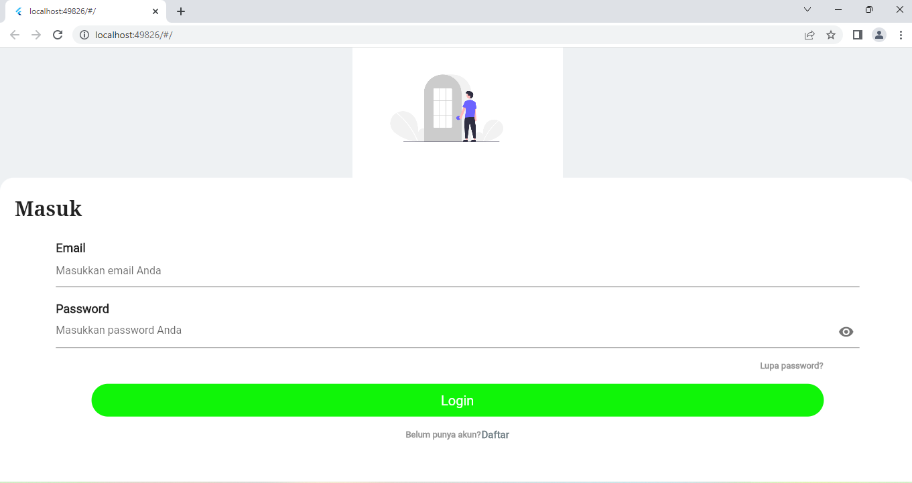
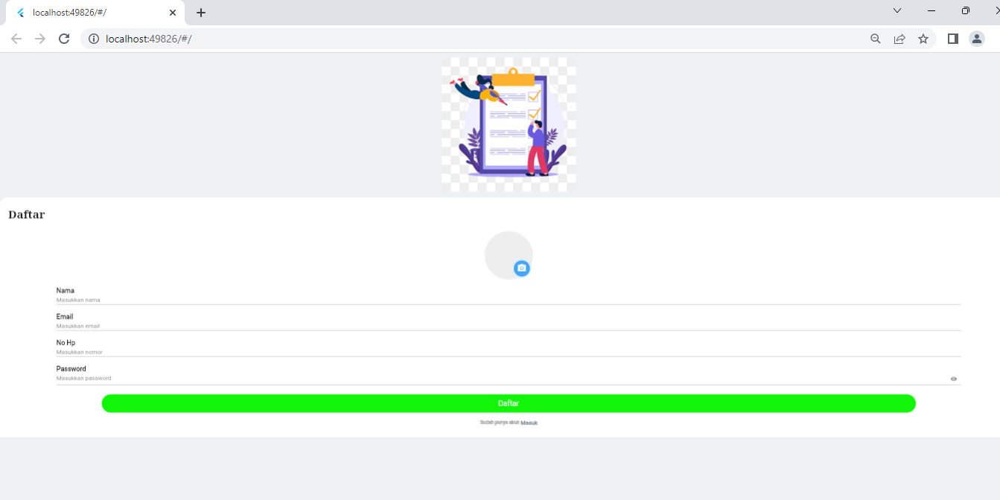
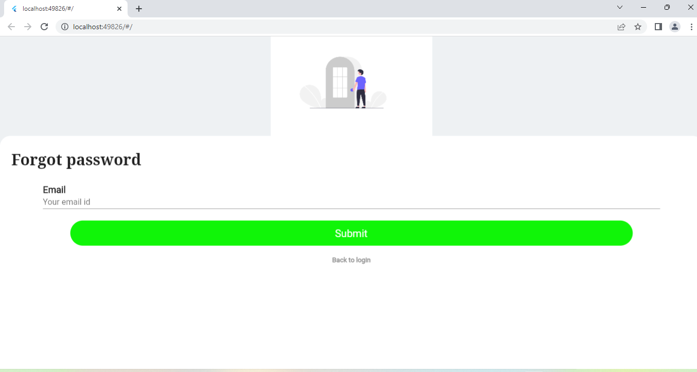

# UTS PEMROGRAMAN MOBILE FLUTTER (Login & Register)

**_Nama: Nuryadi_**  
**_Nim : 312010621_**  
**_Kelas : TI.20.A.3_**  
**_Mata Kuliah : Pemrograman Mobile_**  

 

## Deskription

Form Login & Regiater ini di buat untuk memudahkan pengguna untuk mengisikan data pada form register dan bisa masuk atau login melalui tampilan login yang di sediakan dengan UI friendly--

 

## Features

- Login
- Register
- Forgot Password

 

## Screenshots

 

### UI Design Figma

  
  
  

